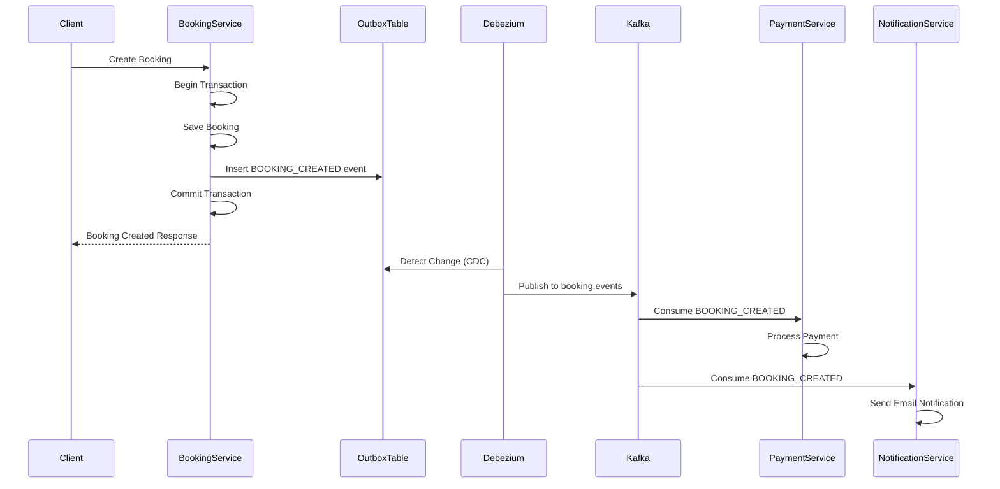
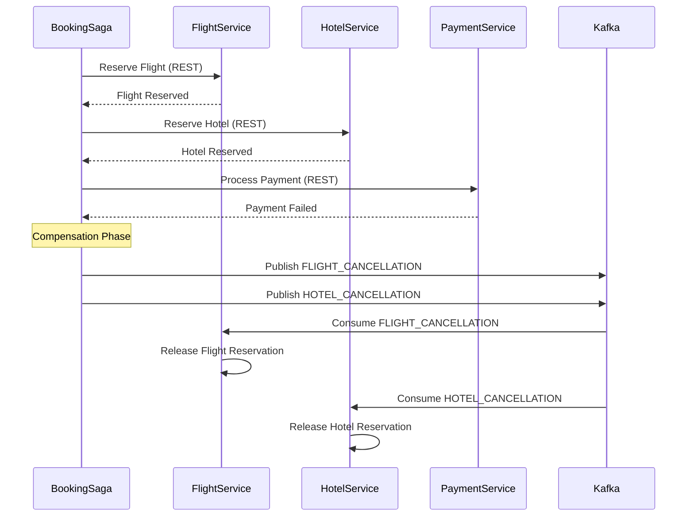

# Service Communication Architecture

## Overview

The BookingSmart microservices architecture implements a hybrid communication approach using:
- **Synchronous REST APIs** via Spring Cloud Eureka for real-time service discovery and request-response patterns
- **Asynchronous Event-Driven Messaging** via Apache Kafka with the Transactional Outbox Pattern for eventual consistency

## 1. Synchronous REST Communication via Eureka

### Service Discovery with Eureka

All microservices register with the Eureka Discovery Service for dynamic service discovery and load balancing.

#### Eureka Server Configuration
```yaml
# discovery-service/application.yml
server:
  port: 8761
  
eureka:
  instance:
    hostname: localhost
  client:
    serviceUrl:
      defaultZone: http://localhost:8761/eureka
```

#### Service Registration
Each service registers itself with Eureka on startup:

```yaml
# Example: booking-service/application.yml
eureka:
  client:
    serviceUrl:
      defaultZone: http://localhost:8761/eureka
  instance:
    hostname: localhost
    prefer-ip-address: false  # true in Docker environment
```

### REST Client Implementation

Services communicate synchronously using WebClient (reactive) or RestTemplate (blocking):

#### WebClient Example (Payment Service → Customer Service)
```java
// payment-service/CustomerServiceClient.java
@Component
public class CustomerServiceClient {
    private final WebClient webClient;
    
    @Value("${customer-service.base-url:http://customer-service}")
    private String customerServiceBaseUrl;
    
    public CustomerProfile getCustomerProfile(UUID userId) {
        return webClient.get()
            .uri(customerServiceBaseUrl + "/api/customers/profile")
            .header("X-User-ID", userId.toString())
            .retrieve()
            .bodyToMono(CustomerProfile.class)
            .timeout(Duration.ofSeconds(10))
            .block();
    }
}
```

### Service URLs Configuration

Services define URLs for inter-service communication in their application.yml:

```yaml
# booking-service/application.yml
booking:
  services:
    urls:
      flight-service: http://flight-service:8081
      hotel-service: http://hotel-service:8082
      payment-service: http://payment-service:8080
      notification-service: http://notification-service:8080
```

### Service Endpoints and Context Paths

Each service exposes its REST API with a specific context path:

| Service | Port | Context Path | Base URL |
|---------|------|--------------|----------|
| Booking Service | 8083 | /bookings | http://booking-service:8083/bookings |
| Flight Service | 8081 | /flights | http://flight-service:8081/flights |
| Hotel Service | 8082 | /hotels | http://hotel-service:8082/hotels |
| Payment Service | 8080 | /payments | http://payment-service:8080/payments |
| Notification Service | 8087 | /notifications | http://notification-service:8087/notifications |
| Customer Service | 8084 | /customers | http://customer-service:8084/customers |

## 2. Asynchronous Event-Driven Communication via Kafka

### Transactional Outbox Pattern

The system implements the Transactional Outbox Pattern to guarantee reliable event publishing with at-least-once delivery semantics.

#### How It Works

1. **Transaction Boundary**: Business operations and outbox events are persisted in the same database transaction
2. **Event Storage**: Events are stored in an `outbox_events` table with processing status
3. **CDC (Change Data Capture)**: Debezium monitors the outbox table and publishes events to Kafka
4. **Event Processing**: Consumers process events and update their local state
5. **Retry Mechanism**: Failed events are retried with exponential backoff

#### BaseOutboxEvent Structure
```java
// common-lib/BaseOutboxEvent.java
@MappedSuperclass
public class BaseOutboxEvent extends AbstractAuditEntity {
    private String eventId;        // Unique event identifier
    private String eventType;       // Event type (e.g., BOOKING_CREATED)
    private String aggregateId;     // Business entity ID
    private String aggregateType;   // Entity type (e.g., Booking)
    private String payload;         // JSON event data
    private Boolean processed;      // Processing status
    private Integer retryCount;     // Current retry attempts
    private Integer maxRetries;     // Maximum retry limit (default: 3)
    private LocalDateTime nextRetryAt; // Next retry timestamp
    private String errorMessage;    // Last error message
}
```

### Kafka Topic Naming Convention

Topics follow a consistent naming pattern: `{domain}.{event-type}`

#### Core Event Topics

```yaml
# booking-service/application.yml
outbox:
  topics:
    booking-events: booking.events      # Booking domain events
    payment-events: payment.events      # Payment processing events
    flight-events: flight.events        # Flight inventory events
    hotel-events: hotel.events          # Hotel inventory events
    notification-events: notification.events # Notification events
```

#### CDC Topics (Debezium)

CDC topics for outbox tables follow the pattern: `cdc.{service}.outbox_events`

- `cdc.booking.outbox_events` - Booking service outbox changes
- `cdc.payment.outbox_events` - Payment service outbox changes
- `cdc.flight.outbox_events` - Flight service outbox changes
- `cdc.hotel.outbox_events` - Hotel service outbox changes

### Kafka Configuration

#### Bootstrap Servers
```yaml
spring:
  kafka:
    bootstrap-servers: ${KAFKA_BOOTSTRAP_SERVERS:localhost:9092}
    consumer:
      group-id: ${spring.application.name}  # Service-specific consumer group
```

#### Consumer Groups

Each service has its own consumer group to ensure all instances receive events:
- `booking-service` - Processes booking-related events
- `payment-service` - Processes payment events
- `notification-service` - Processes notification triggers
- `flight-service` - Processes flight inventory updates
- `hotel-service` - Processes hotel inventory updates

### Event Flow Examples

#### 1. Booking Creation Flow



#### 2. Saga Pattern with Compensation



### Event Processing Configuration

#### Outbox Relay Configuration
```yaml
# booking-service/application.yml
outbox:
  relay:
    fixed-delay-ms: 5000      # Polling interval for unprocessed events
    retry-delay-ms: 10000     # Delay between retries
    max-retries: 3            # Maximum retry attempts
```

#### Kafka Listener Example
```java
@Component
public class PaymentEventConsumer {
    
    @KafkaListener(
        topics = "booking.events",
        groupId = "payment-service",
        containerFactory = "kafkaListenerContainerFactory"
    )
    public void handleBookingEvent(BookingEvent event) {
        switch (event.getEventType()) {
            case "BOOKING_CREATED":
                processPaymentForBooking(event);
                break;
            case "BOOKING_CANCELLED":
                refundPayment(event);
                break;
        }
    }
}
```

## 3. Communication Patterns by Use Case

### Real-Time Queries (Synchronous REST)
- **Customer Profile Lookup**: Payment Service → Customer Service
- **Inventory Availability Check**: Booking Service → Flight/Hotel Services
- **Price Calculation**: Booking Service → Flight/Hotel Services
- **User Authentication**: All Services → Auth Service via Eureka

### Event-Driven Updates (Asynchronous Kafka)
- **Booking Confirmations**: Booking Service → Notification Service
- **Payment Processing**: Payment Service → Booking Service
- **Inventory Updates**: Flight/Hotel Services → Booking Service
- **Status Changes**: All Services → Notification Service

### Hybrid Approach (Saga Pattern)
The booking saga orchestrator uses both patterns:
1. **Synchronous calls** for immediate validations and reservations
2. **Asynchronous events** for compensations and notifications

```java
// BookingSagaOrchestrator.java
public class BookingSagaOrchestrator {
    
    // Synchronous REST call for validation
    public void validateInventory(BookingRequest request) {
        FlightAvailability flight = restTemplate.getForObject(
            flightServiceUrl + "/api/flights/" + request.getFlightId(),
            FlightAvailability.class
        );
    }
    
    // Asynchronous event for compensation
    public void compensateFlightReservation(String bookingId) {
        FlightCancellationEvent event = new FlightCancellationEvent(bookingId);
        kafkaTemplate.send("flight.events", event);
    }
}
```

## 4. Resilience and Error Handling

### Circuit Breaker Pattern
Services implement circuit breakers for REST calls to prevent cascading failures:

```java
@Component
public class CustomerServiceClient {
    
    public CustomerProfile getCustomerProfile(UUID userId) {
        try {
            // Attempt to fetch from Customer Service
            return webClient.get()
                .uri(customerServiceBaseUrl + "/api/customers/profile")
                .retrieve()
                .bodyToMono(CustomerProfile.class)
                .timeout(Duration.ofSeconds(10))
                .block();
        } catch (Exception e) {
            // Fallback to default profile
            return createFallbackProfile(userId);
        }
    }
}
```

### Retry Mechanism for Events
Failed events are automatically retried with exponential backoff:

```java
public void markAsFailed(String errorMessage) {
    this.retryCount++;
    this.errorMessage = errorMessage;
    
    // Exponential backoff: 2, 4, 8 minutes
    if (this.retryCount < this.maxRetries) {
        long delayMinutes = (long) Math.pow(2, this.retryCount);
        this.nextRetryAt = LocalDateTime.now().plusMinutes(delayMinutes);
    }
}
```

### Dead Letter Queue (DLQ)
Events that exceed max retries are moved to DLQ for manual intervention:
- `booking.events.dlq` - Failed booking events
- `payment.events.dlq` - Failed payment events

## 5. Monitoring and Observability

### Service Discovery Health
- Eureka Dashboard: http://localhost:8761
- Service registration status
- Instance health checks

### Kafka Metrics
- Consumer lag monitoring
- Event processing rate
- Failed event tracking

### Distributed Tracing
- Correlation IDs propagated through headers
- Event tracing through aggregate IDs
- Request tracing via Spring Cloud Sleuth

## 6. Best Practices

### Synchronous Communication
1. **Use Circuit Breakers**: Implement fallback mechanisms for service failures
2. **Set Timeouts**: Configure appropriate timeouts for REST calls
3. **Cache Responses**: Cache frequently accessed data to reduce load
4. **Version APIs**: Use versioned endpoints for backward compatibility

### Asynchronous Communication
1. **Idempotent Consumers**: Design consumers to handle duplicate events
2. **Event Ordering**: Use partition keys for ordered event processing
3. **Schema Evolution**: Version event schemas for compatibility
4. **Monitoring**: Track consumer lag and processing metrics
5. **Error Handling**: Implement DLQ for unprocessable events

### Outbox Pattern
1. **Transaction Boundaries**: Always persist events within business transactions
2. **Event Granularity**: Keep events focused and domain-specific
3. **Cleanup Policy**: Implement retention policies for processed events
4. **Performance**: Index outbox tables appropriately for CDC queries

## Summary

The BookingSmart architecture effectively combines:
- **Eureka-based service discovery** for dynamic, resilient REST communication
- **Kafka with Outbox Pattern** for reliable, eventually consistent event processing
- **Hybrid approach** enabling both real-time responses and eventual consistency
- **Built-in resilience** through retries, circuit breakers, and fallback mechanisms

This design ensures high availability, scalability, and data consistency across the distributed microservices ecosystem.
