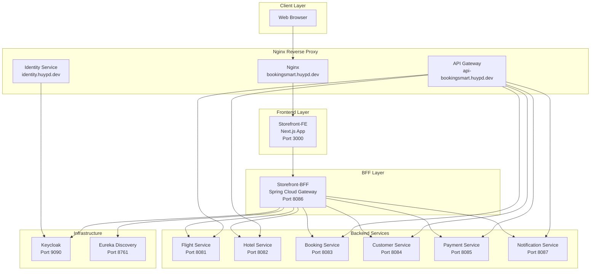
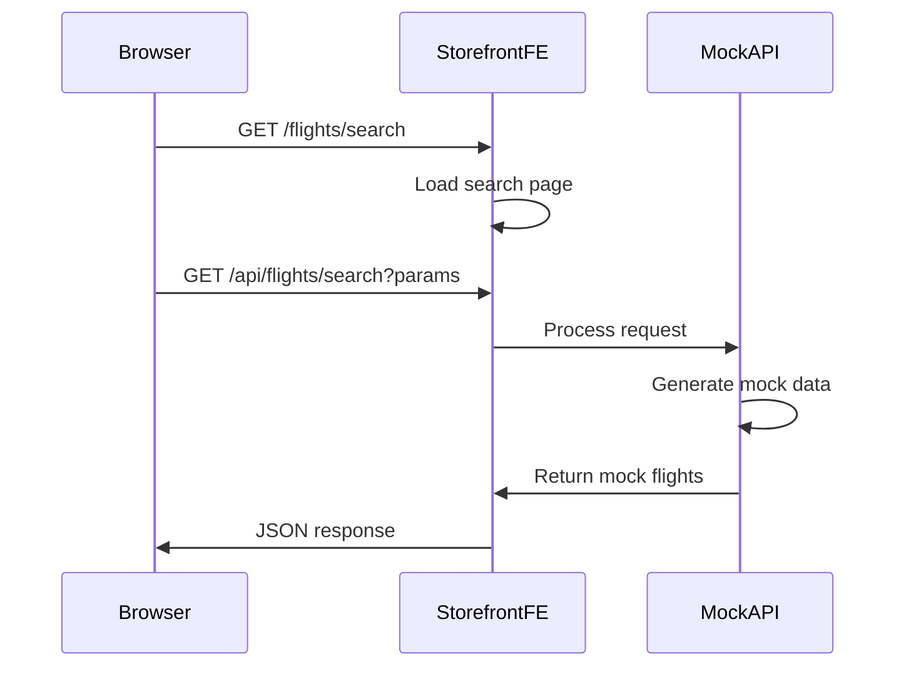
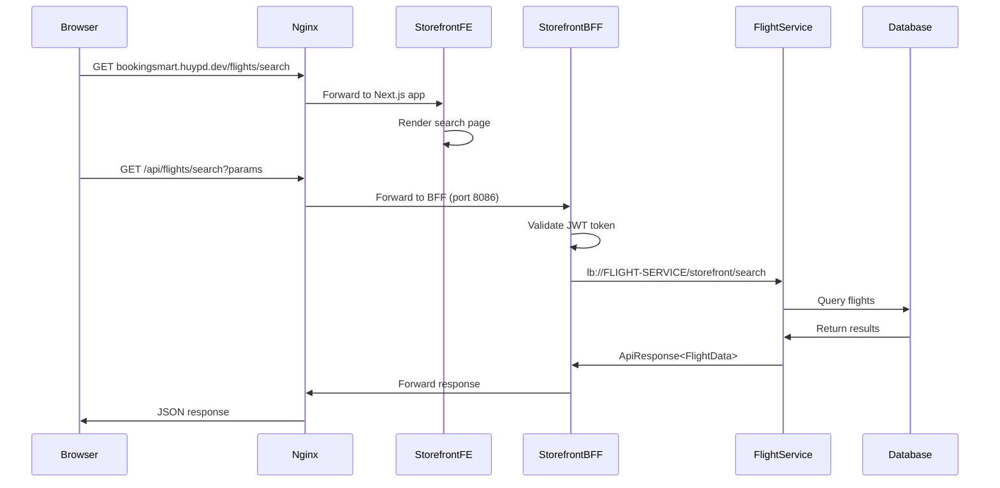
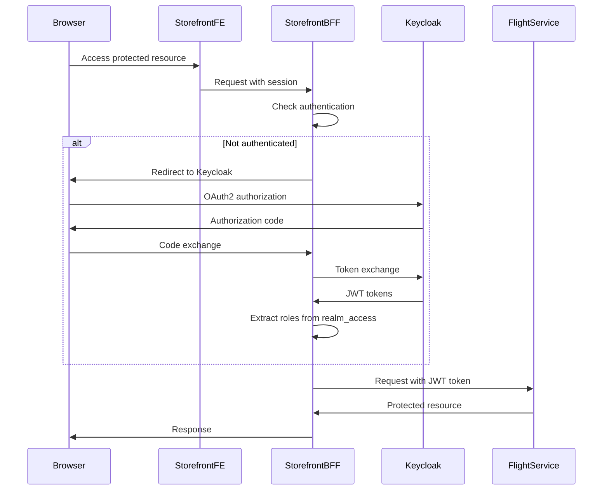

# BookingSmart Request Flow Analysis

## Executive Summary

This document provides a comprehensive analysis of the complete request flow from the storefront-fe components through the storefront-bff routing layer and nginx reverse proxy configuration to the backend services at https://bookingsmart.huypd.dev/api.

## Current Architecture Overview

### High-Level Architecture



## 1. Storefront-FE Architecture Analysis

### Next.js API Routes Structure

The storefront-fe currently implements a **mock-based API layer** with the following structure:

```
storefront-fe/app/api/
├── customer/
│   ├── bookings/[bookingId]/
│   │   ├── cancel/route.ts          # POST - Cancel booking
│   │   ├── confirmation/route.ts    # GET - Booking confirmation
│   │   └── route.ts                 # GET - Booking details
│   └── [customerId]/
│       ├── bookings/route.ts        # GET - Customer booking history
│       └── route.ts                 # GET - Customer details
├── flights/
│   ├── search/route.ts              # GET - Flight search
│   └── [flightId]/
│       └── seats/
│           ├── route.ts             # GET - Seat map
│           └── select/route.ts      # POST - Select seats
├── hotels/
│   └── search/route.ts              # GET - Hotel search
├── locations/
│   ├── popular/route.ts             # GET - Popular locations
│   └── search/route.ts              # GET - Location search
└── payments/
    ├── momo/create/route.ts         # POST - MoMo payment
    ├── stripe/create-intent/route.ts # POST - Stripe payment
    ├── zalopay/create/route.ts      # POST - ZaloPay payment
    └── status/[paymentId]/route.ts  # GET - Payment status
```

### Key Findings - Frontend Layer

1. **Current State**: All API routes return **mock data** - no actual integration with storefront-bff
2. **API Structure**: Well-organized RESTful endpoints following Next.js 13+ App Router conventions
3. **Service Layer**: LocationService implements client-side caching and mock data management
4. **Type Safety**: TypeScript interfaces defined for API responses and common types
5. **Error Handling**: Basic try-catch blocks with generic error responses

### API Constants and Configuration

```typescript
// storefront-fe/lib/constants.ts
export const API_ENDPOINTS = {
  FLIGHTS: "/api/flights",
  HOTELS: "/api/hotels", 
  BOOKINGS: "/api/bookings",
} as const
```

## 2. Storefront-BFF Architecture Analysis

### Spring Cloud Gateway Configuration

The storefront-bff acts as an **API Gateway** using Spring Cloud Gateway with the following key components:

#### Controller Layer
- **AuthenticationController**: Single endpoint `/authentication/user` for OAuth2 user info
- **Minimal Implementation**: Only authentication-related endpoints currently implemented

#### Security Configuration (WebSecurityConfig)
```java
@Configuration
@EnableWebFluxSecurity
public class WebSecurityConfig {
    // OAuth2 Login with Keycloak integration
    // Role-based authorization from Keycloak realm_access claims
    // OIDC logout handling
}
```

#### Gateway Routes Configuration

**Local Profile (Development)**:
```yaml
spring:
  cloud:
    gateway:
      routes:
        - id: api
          uri: http://api.bookingsmart.local
          predicates:
            - Path=/api/**
          filters:
            - RewritePath=/api/(?<segment>.*), /${segment}
            - TokenRelay=
```

**Docker Profile (Production)**:
```yaml
spring:
  cloud:
    gateway:
      routes:
        - id: flight-service
          uri: lb://FLIGHT-SERVICE
          predicates:
            - Path=/api/flights/**
          filters:
            - StripPrefix=1
            - TokenRelay=
        - id: hotel-service
          uri: lb://HOTEL-SERVICE
          predicates:
            - Path=/api/hotels/**
        - id: booking-service
          uri: lb://BOOKING-SERVICE
          predicates:
            - Path=/api/bookings/**
        - id: customer-service
          uri: lb://CUSTOMER-SERVICE
          predicates:
            - Path=/api/customers/**
        - id: payment-service
          uri: lb://PAYMENT-SERVICE
          predicates:
            - Path=/api/payments/**
        - id: notification-service
          uri: lb://NOTIFICATION-SERVICE
          predicates:
            - Path=/api/notifications/**
```

### Key Features

1. **Service Discovery**: Eureka integration with load balancing (`lb://SERVICE-NAME`)
2. **Authentication**: OAuth2/OIDC integration with Keycloak
3. **Token Relay**: Automatic JWT token forwarding to backend services
4. **Path Rewriting**: URL transformation for backend service routing
5. **Session Management**: SaveSession filter for stateful operations

## 3. Nginx Reverse Proxy Configuration

### Domain-Based Routing

```nginx
# Main storefront application
server {
    listen 80;
    server_name bookingsmart.huypd.dev;
    location / {
        proxy_pass http://storefront;
        # Standard proxy headers
    }
}

# API Gateway for direct backend access
server {
    listen 80;
    server_name api-bookingsmart.huypd.dev;
    
    location /customers/ { proxy_pass http://customer-service; }
    location /bookings/ { proxy_pass http://booking-service; }
    location /flights/ { proxy_pass http://flight-service; }
    location /hotels/ { proxy_pass http://hotel-service; }
    location /payments/ { proxy_pass http://payment-service; }
    location /notifications/ { proxy_pass http://notification-service; }
}

# Identity service (Keycloak)
server {
    listen 80;
    server_name identity.huypd.dev;
    location / {
        proxy_pass http://identity;
        # Keycloak-specific headers and settings
    }
}
```

### Key Configuration Features

1. **Domain Separation**: Different subdomains for different concerns
2. **Direct Service Access**: API gateway bypasses BFF for direct backend access
3. **Identity Integration**: Dedicated domain for Keycloak authentication
4. **Header Management**: Proper forwarding of client information

## 4. Backend Service Integration Points

### Flight Service Example

```java
@RestController
public class FlightController {
    
    @GetMapping("/storefront/search")
    public ResponseEntity<Map<String, Object>> searchFlights(
        @RequestParam String origin,
        @RequestParam String destination,
        @RequestParam String departureDate,
        @RequestParam(defaultValue = "1") int passengers,
        @RequestParam(defaultValue = "ECONOMY") String seatClass,
        @RequestParam(defaultValue = "1") int page,
        @RequestParam(defaultValue = "20") int limit) {
        
        // Database query with pagination
        Page<Flight> flightPage = flightRepository.findFlightsByRoute(
            origin, destination, depDate, pageable);
            
        // Response transformation
        List<Map<String, Object>> flights = flightPage.getContent()
            .stream()
            .map(this::convertFlightToResponse)
            .collect(Collectors.toList());
            
        return ResponseEntity.ok(response);
    }
}
```

### Common API Response Structure

```java
@Data
@Builder
@JsonInclude(JsonInclude.Include.NON_NULL)
public class ApiResponse<T> {
    private boolean success;
    private String message;
    private T data;
    private String errorCode;
    private LocalDateTime timestamp;
    private Object metadata;
    private String requestId;
    
    // Static factory methods for success/error responses
    public static <T> ApiResponse<T> success(T data) { ... }
    public static <T> ApiResponse<T> error(String message, String errorCode) { ... }
}
```

## 5. Request Flow Diagrams

### Current Request Flow (Mock Implementation)



### Intended Request Flow (Full Integration)



### Authentication Flow



## 6. Middleware Interaction Analysis

### Spring Cloud Gateway Filters

1. **TokenRelay Filter**: Automatically forwards JWT tokens to backend services
2. **StripPrefix Filter**: Removes path prefixes before forwarding
3. **RewritePath Filter**: Transforms URLs for backend compatibility
4. **SaveSession Filter**: Maintains session state across requests

### Security Middleware

1. **OAuth2 Login**: Handles Keycloak integration
2. **JWT Token Validation**: Validates incoming tokens
3. **Role Extraction**: Maps Keycloak roles to Spring Security authorities
4. **CORS Configuration**: Handles cross-origin requests

## 7. API Gateway Patterns

### Current Implementation

1. **Backend for Frontend (BFF)**: Storefront-BFF tailored for web client needs
2. **Service Discovery**: Eureka-based service resolution
3. **Load Balancing**: Client-side load balancing via Spring Cloud LoadBalancer
4. **Circuit Breaker**: Not currently implemented (recommended addition)
5. **Rate Limiting**: Not currently implemented (recommended addition)

### Request Aggregation

Currently **not implemented** - each service call is independent. Potential for:
- Flight + Hotel combo searches
- Booking + Payment + Notification orchestration
- Customer profile + Booking history aggregation

## 8. Configuration Management

### Environment-Specific Configuration

**Local Development**:
- Direct service URLs (http://api.bookingsmart.local)
- Local Keycloak (localhost:9090)
- Local Eureka (localhost:8761)

**Docker/Production**:
- Service discovery via Eureka
- Environment variable configuration
- Container-based service resolution

### Key Configuration Points

1. **Keycloak Integration**: Client secrets and issuer URIs
2. **Service Discovery**: Eureka server locations
3. **Database Connections**: Per-service database configuration
4. **Kafka Configuration**: Event streaming setup

## 9. Error Handling Flow

### Error Propagation Chain

```mermaid
graph LR
    A[Backend Service Error] --> B[ApiResponse.error()]
    B --> C[Spring Cloud Gateway]
    C --> D[HTTP Status Mapping]
    D --> E[Frontend Error Boundary]
    E --> F[User-Friendly Message]
```

### Error Types and Handling

1. **Validation Errors**: `VALIDATION_ERROR` with field-specific messages
2. **Authentication Errors**: `UNAUTHORIZED` with redirect to login
3. **Authorization Errors**: `FORBIDDEN` with access denied message
4. **Service Errors**: `INTERNAL_SERVER_ERROR` with generic message
5. **Not Found Errors**: `NOT_FOUND` with resource-specific message

## 10. Critical Gaps and Recommendations

### Current Gaps

1. **Frontend-BFF Integration**: Storefront-FE still uses mock APIs
2. **Error Handling**: Limited error boundary implementation
3. **Caching Strategy**: No distributed caching layer
4. **Monitoring**: Limited observability and tracing
5. **Circuit Breakers**: No resilience patterns implemented

### Recommended Implementation Steps

1. **Replace Mock APIs**: Update storefront-FE to call storefront-BFF endpoints
2. **Add HTTP Client**: Implement proper HTTP client with retry logic
3. **Error Boundaries**: Add React error boundaries for graceful degradation
4. **Caching Layer**: Implement Redis-based caching in BFF
5. **Monitoring**: Add distributed tracing and metrics collection
6. **Circuit Breakers**: Implement Hystrix or Resilience4j patterns

## 11. Security Considerations

### Current Security Measures

1. **OAuth2/OIDC**: Keycloak integration for authentication
2. **JWT Tokens**: Stateless authentication with role-based access
3. **Token Relay**: Automatic token forwarding to backend services
4. **HTTPS Termination**: SSL/TLS handled by reverse proxy

### Security Recommendations

1. **API Rate Limiting**: Implement per-user/IP rate limiting
2. **Input Validation**: Add comprehensive request validation
3. **CSRF Protection**: Enable CSRF tokens for state-changing operations
4. **Security Headers**: Add security headers (HSTS, CSP, etc.)
5. **Token Refresh**: Implement automatic token refresh logic

## Conclusion

The BookingSmart application implements a solid microservices architecture with proper separation of concerns. However, the storefront-fe currently operates with mock data and requires integration with the storefront-bff to complete the request flow. The infrastructure is well-designed for scalability and security, with room for improvements in resilience patterns and observability.

The next phase should focus on connecting the frontend to the BFF layer and implementing proper error handling and caching strategies to create a robust, production-ready system.